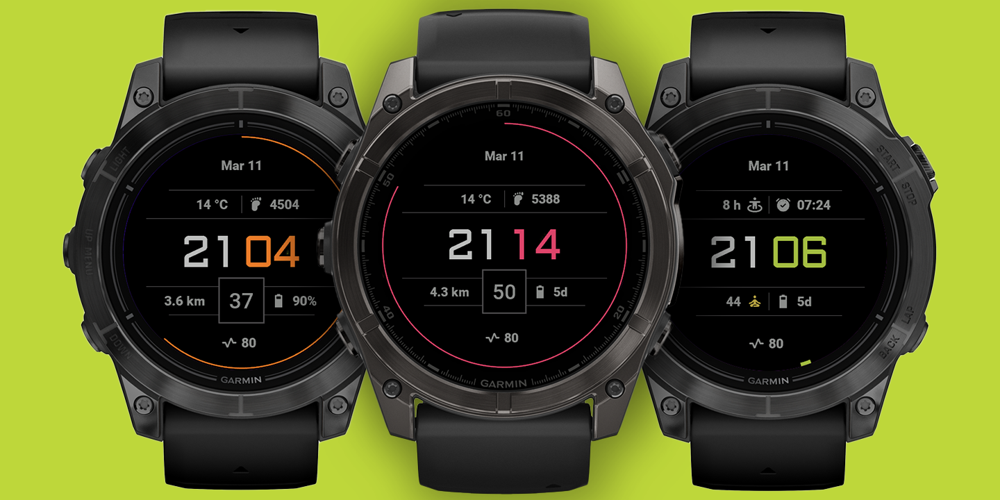

# Garmin Watch Face "neon digits alpha"

Simple watch face with configurable data fields for current temperature, heart rate, daily distance, calorie consumption, steps, etc.
Seconds-Ring available in two variants (can be disabled).
Various color schemes.

### Device compatibility

Customizable digital watchface for the following Garmin watches:

- Approach S70 47mm
- D2 Air X10
- Epix (Gen 2)
- Epix Pro (Gen 2)
- Fēnix 8 (43mm, 47mm, 51mm)
- Venu 2
- Venu 2 Plus
- Venu 3
- Venu 3S
- Forerunner 265
- Forerunner 965

### Features

- Time (it's a watch face ...)
- Seconds (can be disabled)
- Color presets
- Calories
- Steps
- Activity minutes (day)
- Distance
- Current temperature
- Battery status
- Heartrate
- Arc / Cycle (24 h / 60 sec)
- AOD Mode with burn-in protection
- All settings can be configured without the "Connect IQ" app inside the watch

### Screenshot

### Installation

Go to Connect IQ website to get the theme or follow the instructions on the Garmin Developer Website to learn how to compile this repo and generate the prg-File.

### Resources

1. Garmin Api overview: https://developer.garmin.com/connect-iq/overview/
